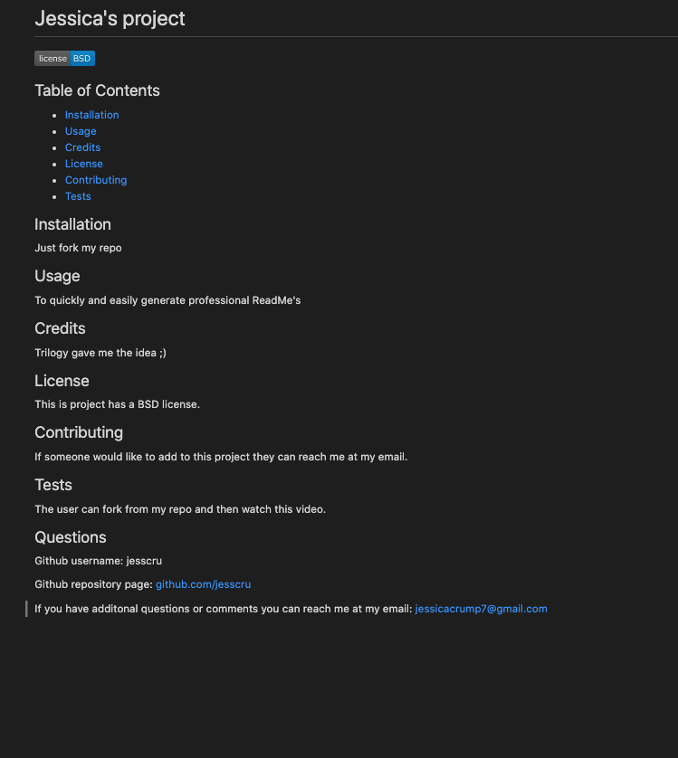

# README Generator

## Table of Contents 

* [Installation](#installation)
* [Usage](#usage)
* [Credits](#credits)
* [License](#license)
* [Contributing](#contributing)

## Usage 

This program serves as a quick and easy way to make professional looking README.md files for anyone's project. The user will be prompted to answer questions regarding their projects use, installation, licensing, contributions, etc.. All of that information will then be placed in their generated README.md file titled yourREADME.md. It is recommended to the user, however, that they rename the file to just README.md as it follows the standard of professional README.md's. 

## Installation 

The user may fork this repository, which contains all of the necessaary packages. However, it may be worth double checking that the package.json file does in fact have the dependency value of "inquirer." If for some reason it does not. From your terminal, in the readme-generator directory, type npm i install inquirer and check again; it should show up now. Otherwise, after the directory is on your local machine, just move into the readme-generator directory and type 'node index' into your terminal. From there, the prompts will guide you. 

Below is a link to a video that walks the user through running the program and the product and function of the README.md it creates. One can also find the video on my repository page. 
https://drive.google.com/file/d/1PgRLuidLQuXi6f9KLOFttjMTMbfXv2Bc/view

Below is an example of the output of the generator. 

## Credits

This app was created using [Node.js](https://nodejs.org/en/) and the [Inquirer package](https://www.npmjs.com/package/inquirer)

## Contributing

I welcome any ideas anyone might have to contribute to this project. Please reach me at the email below if you have suggestions or ideas you'd like to add to the project. 

## Questions 
  
Github username: jesscru

Github repository page: github.com/jesscru

If you have additonal questions or comments you can reach me at my email: jessicacrump7@gmail.com
